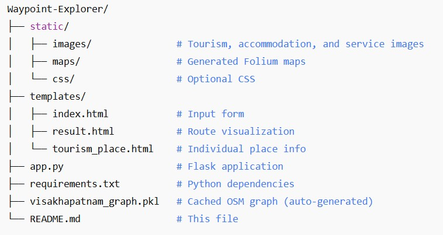
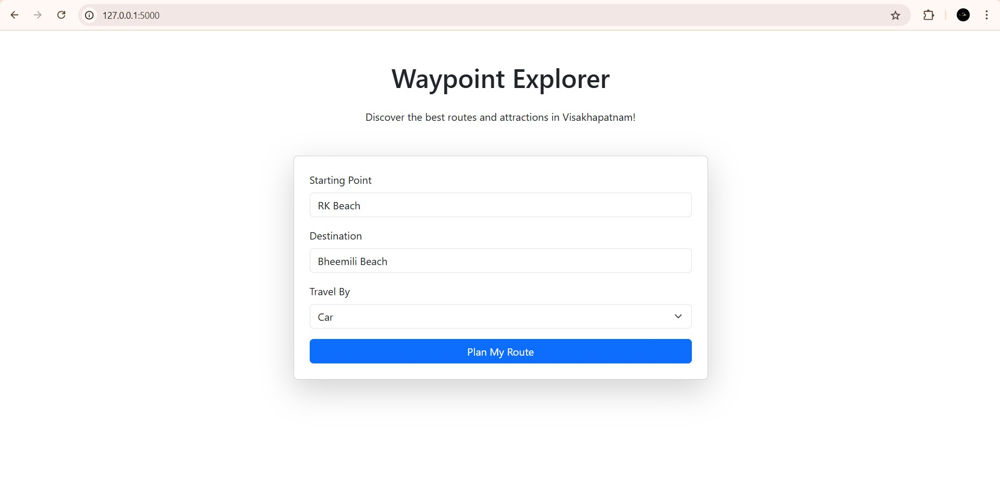
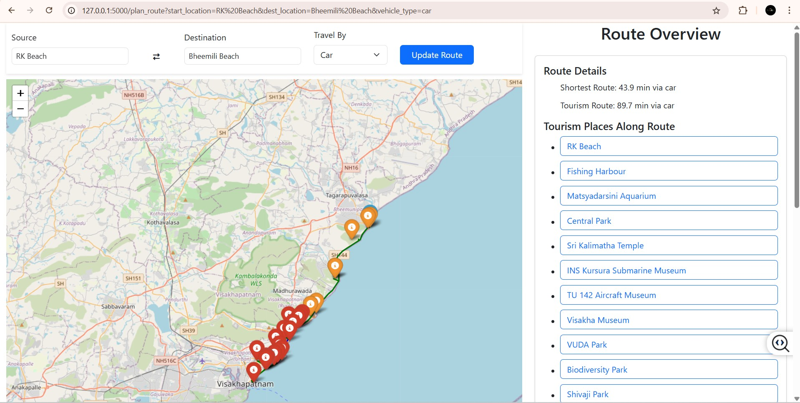
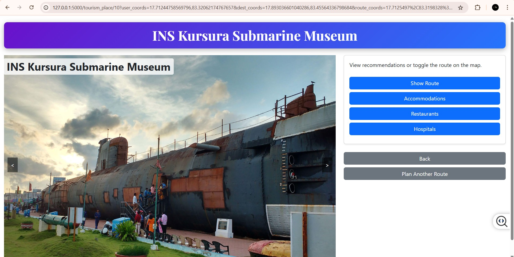
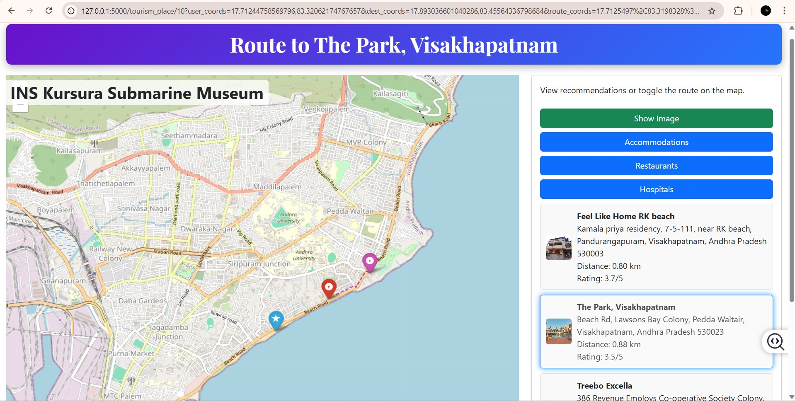

# 🌐 Waypoint Explorer

**Waypoint Explorer** is a Flask-based web application designed to plan optimal driving routes in **Visakhapatnam, Andhra Pradesh, India**. It leverages **OpenStreetMap (OSM)** data via the `osmnx` library to generate shortest and tourism-optimized routes between user-specified locations.

The application includes:

- 🧠 Machine learning models for travel time prediction and tourism popularity scoring
- 🗺️ Interactive map visualizations using **Folium**
- 🏨 Nearby recommendations (accommodations, restaurants, and hospitals within 3 km)

---

## 🚀 Features

- **Route Planning**: Compute the shortest and tourism-optimized routes using the **A\*** search algorithm.
- **Travel Time Prediction**: Estimate travel time based on distance, vehicle type (car, bike, auto), and time of day using a linear regression model.
- **Tourism Place Popularity**: Score tourism places based on distance from the city center, nearby amenities, and accessibility using ML.
- **Nearby Recommendations**: Suggest accommodations, restaurants, and hospitals with distance, rating, and images.
- **Interactive Maps**: Display routes and points of interest on **Folium** maps.
- **Caching**: Store OSM graph and route data to improve speed.
- **Autocomplete Search**: Provide real-time location suggestions.

---

## 📦 Prerequisites

- Python 3.8 or higher
- A modern web browser (Chrome, Firefox, etc.)
- Internet connection (for the initial OSM data download)

---

## 🖼️ Prepare Static Assets

Ensure the following image files are present in the `static/images/` directory:

- `rk_beach.jpg`
- `Feel_Like_Home_RK_beach.jpg`
- `aha.jpg`
- `nri.jpeg`

Additionally, include any other relevant images extracted from your `visakhapatnam_data` dataset (such as landmark images, place thumbnails, etc.) into the same `static/images/` directory.

---

## 🌐 Usage

### ▶️ Run the Application

python app.py

## 🧭 Plan a Route

1. **Enter a Starting Location**  
   Example: `"Tagarapuvalasa"`

2. **Enter a Destination**  
   Example: `"RK Beach"`

3. **Select a Vehicle Type**  
   Choose from available options (e.g., car, bike).

4. **Click on "Plan Route"**  
   The app will generate your route and visualizations.

---

## 🗺️ View the Results

The application displays an **interactive map** with the following features:

- 🔵 **Shortest Route** (Blue)
- 🟢 **Tourism-Optimized Route** (Green)
- ⏱️ **Predicted Travel Times** for both routes

---

### 🧩 Interact with the Map

Click on any **tourism place marker** to access:

- 🖼️ **Details with Multiple Images**
- 📍 **Recommendations for Nearby Places** (within 3 km)
- 🧭 **Routes to Recommended Locations**

---

##  📁 Project Structure

---

  
   

---

## 🧠 Data

The app uses a predefined `visakhapatnam_data` dictionary containing categorized locations:

- **General Locations**  
  _e.g.,_ `Tagarapuvalasa`

- **Tourism Places**  
  _e.g.,_ `RK Beach`

- **Accommodations**  
  _e.g.,_ `Feel Like Home RK Beach`

- **Restaurants**  
  _e.g.,_ `Aha Yemi Ruchulu The Kitchen`

- **Hospitals**  
  _e.g.,_ `Queens NRI Hospital`

Each entry includes:

- 📌 Name  
- 📍 Coordinates  
- 🏠 (Optional) Address  
- 🖼️ Image

---

  ## 📊 Machine Learning Models

### 1. 🚗 Travel Time Prediction

- **Inputs:**  
  - Distance (km)  
  - Vehicle Type (e.g., car, bike)  
  - Time of Day (e.g., morning, evening)

- **Model Used:**  
  - `LinearRegression`

- **Output:**  
  - Estimated Travel Time (in minutes)

### 2. 🏞️ Tourism Popularity Scoring

- **Factors Considered:**  
  - Distance from **Dwaraka Nagar** (city center)  
  - Number of **nearby amenities** within 3 km  
  - **Accessibility** via OpenStreetMap (OSM) nodes

- **Model Used:**  
  - `LinearRegression`

- **Output:**  
  - Popularity Score (**0–10**)
 
--- 

## 📸 Images & Data

- 🖼️ **Images**  
  All image files (tourist spots, accommodations, services) are stored in:  
  `static/images/`

- 🗺️ **Map HTML Files**  
  Interactive maps generated by the app are saved to:  
  `static/maps/`  
  *(Created automatically when planning routes)*

- 📍 **Location Data**  
  All locations, tourism places, accommodations, restaurants, and hospitals are defined in the `visakhapatnam_data` dictionary located inside:  
  `app.py`

---

## 🖼️ Screenshots
- Index Page
     

  
   

- Home Page
  

  
   

- Tourism Place Page 
   

     
   

- Recommendations  
   

     
   

---

## 📜License

This project is licensed under the [Apache License 2.0](LICENSE).

---

## 📬Contact

- **Author:** K. Lokesh Kumar
- **Email:** lokeshkumarkona07@gmail.com  
- **LinkedIn:** Lokesh Kumar Kona

⭐ Star this repository if you find it useful!

Thanks for checking out the Waypoint Explorer! 🚀  
